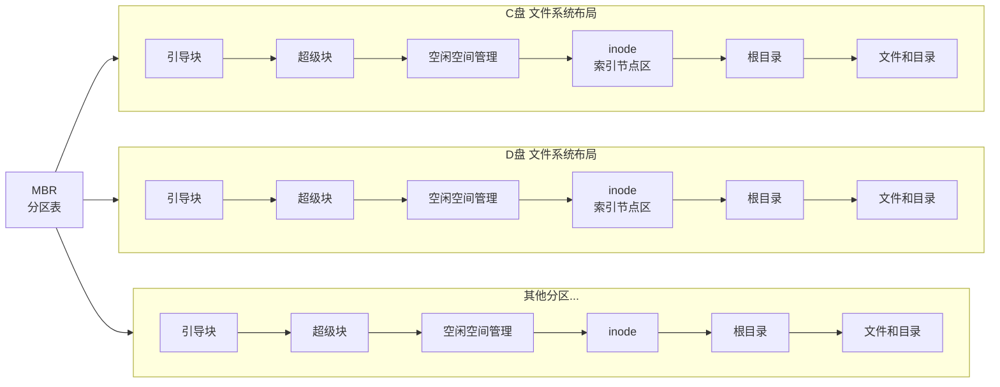
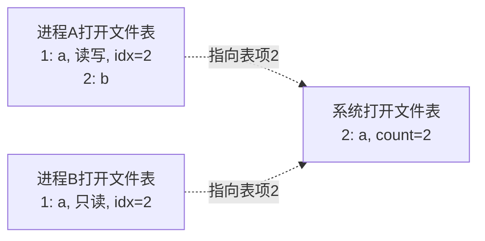

# 文件目录的概念
## 文件控制块(FCB)
FCB存储控制文件需要的各种信息。实现按名存取。FCB的有序集合称为**文件目录**，==**一个FCB就是一个文件目录项**==，一个文件目录也被视为一个文件，称为**目录文件**。

| 文件名  | 类型  | 存取权限 | ... | 物理地址 |
| ---- | --- | ---- | --- | ---- |
| file | txt | 只读   |     |      |
FCB里面没有文件本体，只有指向文件本体的指针。
	例题:新建一个文件时，文件系统建立了(A  ).
	A一个文件目录项 B.一个目录文件 C.逻辑系统 D.逻辑空间
文件目录:FCB的有序集合(数据结构)。
目录文件:文件目录的存储形式(物理实体)。

| 特性      | 基于普通 FCB 的文件系统    | 基于 inode 的文件系统（unix 等系统） |
| ------- | ----------------- | ------------------------ |
| 核心元数据结构 | 文件控制块（FCB）        | 索引节点（inode）              |
| 文件名存储位置 | 在 FCB 内           | 在目录项中（文件名，inode 号）       |
| 文件名与元数据 | 都在 FCB 中          | 文件名在目录项中，元数据在 inode 中    |
| 目录内容    | FCB 列表            | （文件名，inode 号）列表          |
| 元数据     | 无固定区域（FCB 分散在数据区） | 有固定区域（i 节点区）             |
## 索引结点
| 文件名      | 索引结点指针    |
| -------- | --------- |
| filename | 指向外存的索引结点 |

文件元数据(除了文件名，包括本体物理地址)都在索引结点里。

## 文件的查找
1️⃣将存放目录文件的第一个盘块中的目录调入内存
2️⃣用给定的文件名逐个比较，若找到，结束。
3️⃣若未找到，继续将下一盘块目录项调入内存，继续比较，直到找到。若都未找到则未找到。
**检索目录**过程中只使用了**文件名**，仅当找到**目录项**时，才能从该目录项读出文件物理地址。
	例题：一个FCB占64B,盘块大小1KB,每个盘块可容纳16个FCB（必须连续存放），若目录共含640个FCB，则:
	基于普通FCB的文件系统平均需启动(20)次才能完成一次文件查找。
	基于inode的文件系统，每个目录项16B(14B文件名+2B索引结点号)，每块可容纳(64)个目录想，640/64 = 10，平均查找(5)次。

### 磁盘索引节点
存储于磁盘上。每个文件包含唯一磁盘索引节点。包含文件物理地址，文件长度，文件链接计数(硬链接数)...
### 内存索引节点
==**文件被打开时，系统将对应磁盘索引节点载入内存**==，在磁盘索引节点基础上增加:
索引结点号，状态(上锁或修改)，访问计数（进程访问一次，cnt++;访问结束cnt--，判断是否可被释放），逻辑设备号，链接指针等

# 文件目录的结构
## 单级目录
整个文件系统仅一张目录表。**==文件不允许重名==，查找速度慢，不便于文件共享，不能应用于多用户操作系统。**
	例题：一个文件系统中，FCB占64B，盘块大小为1KB，采用一级目录。有3200个目录项，则**查找一个文件**平均需要访问（100）次磁盘。
	tips：注意查找一个文件和访问一个文件的区别。
## 两级目录
主文件目录项记录用户名及相应用户文件目录所在的存储位置。因此**不同用户文件允许重名**。且可以用不同文件名共享一个文件

## 树形目录结构(多级目录)
绝对路径:从**根目录**出发的路径。/dev/hda
相对路径:可为每个进程设置一个**当前目录（工作目录）**，./ls,可以**加快文件检索速度**
优点:便于实现文件分类。缺点:每个文件只有一个父目录，不方便文件共享。
## 无环图目录结构
允许文件子目录有多个父目录。不同文件的目录可以指向同一个文件/子目录。为每个共享结点维护一个**共享计数器**。

# 文件目录的内容、操作
#### 创建文件
1️⃣合法性与权限校验2️⃣分配inode3️⃣分配物理磁盘块4️⃣在目录新建目录项<文件名，inode号>格式5️⃣更新文件系统元数据。  注意⚠️创建文件不等于打开文件
#### 删除文件
1️⃣定位，校验权限2️⃣检查状态与硬链接计数3️⃣目录项删除4️⃣释放inode5️⃣释放磁盘块6️⃣释放内存资源7️⃣更新文件系统元数据 ⚠️关闭不等于删除

####  **打开文件**:将指定文件目录项复制到内存指定区域
进程打开文件表和系统打开文件表：

系统打开文件表:全局共享，每项包含一个打开计数器，记录有多少进程打开了该文件。
进程打开文件表:每个进程独有，**表中每一项指向系统打开文件表的对应项。**

1️⃣根据文件存放路径找到相应目录文件，从目录中找到文件名对应的目录项，并检查权限。
open系统调用：
2️⃣在系统打开文件表中查找对应项，若检索到，在进程打开文件表中分配一个新表项，指向系统打开文件表对应表项。
3️⃣若未检索到，将目录项复制到内存的"系统打开文件表"中，然后在"进程打开文件表"分配新表项fd，返回编号（文件描述符fd）给用户，之后进程使用fd指明要操作的文件。
open()成功后，不再使用文件名，而是使用文件描述符fd，就是**进程打开文件表**的编号

#### 关闭文件
系统调用close()。从该进程的打开文件表中删除对应项，并将系统打开文件表对应项的打开计数器count-1.若count减至0，系统可安全地删除其在系统表中的项并释放所占用的相关资源。
⚠️关闭文件后将文件的控制信息(元数据，目录项信息)协会磁盘，而不是文件数据写回磁盘，只有write()才会写回磁盘。
	例题：关闭文件的主要工作(B)
	A.将文件最新信息从内存写回磁盘
	B.将文件当前控制信息从内存写回磁盘
	C.将位视图从内存写回磁盘
	D.将超级块当前的信息从内存写回磁盘

#### 读文件
首先**根据文件名在目录中查找对应目录项，获取inode号**，进而定位其在外存中的数据块。然后根据读指针位置读取数据，更新指针。
#### 写文件
首先**根据文件名在目录中查找对应目录项，获取inode号**，进而定位其在外存中的数据块。然后根据写指针位置读取数据，更新写指针。若写入超出当前分配空间，系统将动态分配新磁盘块并更新inode(或FCB)中的块指针。

# 文件的物理结构
## 连续分配
每个文件分配连续练林的盘块，FCB目录中记录**第一个记录所在盘块号和文件长度（盘块数）**。(file,start,length)
优点:1️⃣支持顺序访问和直接访问2️⃣顺序访问高效且快，因为文件所占磁道少，寻道时间少。
缺点:1️⃣易产生大量外部碎片 2️⃣难以动态增长 3️⃣插入或删除需要物理移动后续记录。
## 链接分配
**允许文件离散的分配在多个盘块**，通过**每个盘块的链接指针**，形成链表。可以动态分配存储空间，方便文件增删改。
### 隐式链接
文件目录的每个目录项包括**指向链接文件第一个盘块和最后一个盘块的指针**。每个盘块隐式指向下一个盘块。
	优点:1️⃣方便增删改 缺点:1️⃣仅支持顺序访问，访问第i块必须遍历前i-1块。2️⃣可靠性差3️⃣存储下一块指针占用空间。

例题:8个记录L1-L8，隐式链接，主存磁盘缓冲区大小=盘块大小，文件目录已读入内存。现在L5-L6间插入内存中的Lx，需2次写磁盘，5 次读磁盘。
### 显式链接
关键词：FAT。指针显式存放在内存的一张链接表中，且整个文件系统仅一张表。每个盘号内存放下一个盘号的链接指针，-1是最后一块特殊值。（静态链表）。

优点：1️⃣支持顺序访问，也支持直接(随机)访问。2️⃣FAT在系统启动时被载入内存，后续检索在内存完成，减少磁盘次数。缺点:1️⃣FAT常驻内存，增大内存开销。
	$FAT内存容量 = FAT表项数 \times FAT表项大小$

例题 文件系统采用显式连接，盘块大小=4KB,1簇=2块,OS以簇分配盘块。文件系统支持最大文件长度=512MB,若FAT每个表项只存储簇号，则FAT表所占空间 128KB (表项数=512MB/(2* 4KB)=64K,表项大小=16b)
## 索引分配
### 单级索引
**将每个文件所对应盘块号集中放在每个文件的索引块(表)中**。
	目录 {文件名:DEVICE,索引指针:8},8就是索引盘块。索引指针不是索引结点指针。
优点:1️⃣支持直接（随机）访问，访问文件第i块只要读取索引块第i项，即可得到数据块号。2️⃣无外部碎片。可离散分配。缺点:额外存储开销，每个文件必须配备一个索引块。
	**最大文件大小**
	$1索引块最多盘块号数目或地址项数目 = \frac{1个索引块大小}{盘块号大小或地址项大小}=N$
	$最大文件大小 = N \times 单个数据块大小$
	例题：盘块4KB，盘块号占4B，单级索引最大文件大小？
		1索引块最多可存放4KB/4B = 1K个地址项，
		$1K \times 4KB = 4MB.$

### 两级索引
将索引块再分块，建立一级索引(**主索引**)，**主索引表**存放**二级索引块的盘块号**。二级索引块的索引项指向数据块。
$主索引最多盘块号或地址项数目 = \frac{1个索引块大小}{盘块号或地址项大小} = N$
主索引最多指向$N$个二级索引块，二级索引最多有$N^2$个地址项，即指向$N^2$个数据块.
	例题：盘块大小4KB,每个盘块4B，二级索引，最大文件长度？
	$N=4KB/4B = 1K,size = N^2 \times 4KB = 4GB$
	
### 多级索引
$主索引最多盘块号或地址项数目 = \frac{1个索引块大小}{盘块号或地址项大小} = N$
P级索引最多指向$N^P$个数据块。$Maxsize = N^P \times 数据块大小$
	例题 三级索引，每块1KB，盘块索引号4B，最大支持文件尺寸？
	$N = 1KB/4B = 2^8,2^{8*3} \times 1KB =16GB$
### 混合索引
基于索引结点的文件系统。

| 文件名      | 索引结点指针  |
| -------- | ------- |
| filename | 指向inode |
索引结点inode:主标识符，类型，存取权限...,直接地址0-9，一级间址，二级间址，三级间址。$索引结点inode \ne 索引块$
	例题: inode中有7个地址项，4个直接索引，2个一级索引，1个二级索引，地址项大小4B，数据块大小=索引块大小=256B.单个文件最大长度？
	$N = 256B/4B = 64,size = (4+64\times 2+64^2)\times 256B = 1057KB$
	

#### 直接地址
#### 一次间接地址
#### 多次间接地址

一、FCB 硬盘 / 内存区分
1. **磁盘上**：根目录区、子目录区里永久存放着 FCB（文件控制块），断电不消失，是文件的磁盘元数据。
2. **内存里**：打开文件时，操作系统把磁盘FCB复制一份到内存，形成**内存FCB（文件表项）**；文件关闭后，内存FCB销毁，磁盘FCB不变。

> 做题关键：查找文件、读首块号必须先读磁盘目录区的FCB。

 二、FAT分区读文件完整IO次数举例（408标准题型）
前提设定
- 磁盘分区布局：引导块 | FAT表 | 根目录FCB区 | 数据区
- 每一块大小相同，一次IO读**一整个盘块**
- 场景：第一次打开文件 `a.txt`，读取文件全部内容；文件占用3个数据块：5、12、27
- 已知：
  1. FAT表占1个盘块；
  2. 根目录FCB区占1个盘块，`a.txt` 的FCB就在这块里；
  3. 文件首块号 = 5；FAT[5]=12，FAT[12]=27，FAT[27]=结束标记。

 分步IO拆解（每次读磁盘=1次IO）
### 第1次IO：读根目录盘块（拿FCB）
读存放所有根目录FCB的磁盘块，遍历找到`a.txt`的FCB，从中取出**首块号5**。

### 第2次IO：读取整个FAT盘块
FAT整块载入内存，之后查表FAT[5]、FAT[12]、FAT[27]都在内存，**不再产生磁盘IO**。
得到完整数据块序列：5、12、27。

### 第3、4、5次IO：依次读取3个数据块
IO3：读5号数据块
IO4：读12号数据块
IO5：读27号数据块

## 总IO次数
1（目录FCB） + 1（FAT） + 3（数据块） = **5次磁盘IO**
三、拓展考点变体（必考）
## 变体1：多次读取同一文件（已打开，FAT和FCB缓存内存）
文件已经打开，FAT、FCB都在内存，只需读3个数据块 → 仅3次IO。

## 变体2：文件目录不在根目录，在子目录
子目录本身也是一个特殊文件，存一堆FCB，要多一次IO读子目录块，总IO变为6次。

## 变体3：FAT分多块存储
若FAT表占用2个盘块，需要2次IO读完整FAT，总IO+1。

总结
1. FCB本体存在硬盘目录区，打开后拷贝到内存；
2. 首次读文件IO构成：
   读目录FCB块 + 读FAT整块 + 读所有文件数据块 = 总IO。

成组链接法
> 成组链接，每组 100 块，初始超级块栈已满。连续分配 200 块，一共多少次磁盘读 IO？
> 
> 解析：
> 
> 前 100 块：分配完栈空；
> 
> 分配第 101 块：触发 1 次读 IO，栈又填满 100；
> 
> 再分配剩下 99 块，无 IO。
> 
> 总读 IO：**1 次**。

> 连续回收 200 块，初始栈为空，每组 100 块，多少次写 IO？
> 
> 回收前 100 块：栈满；回收第 101 块触发 1 次写 IO；再回收 99 块无 IO。总写 IO=**1 次**。

# 多级索引（inode）磁盘IO计算题（408经典题型）
## 题干条件
1. 磁盘盘块大小：1KB = 1024B
2. 盘块号占4字节，因此一个盘块可存放索引项数量：
$$1024 \div 4 = 256$$
即每个索引块存256个盘块号。
3. inode结构：
   - 10个**直接索引**（直接存数据块号）
   - 1个**一级间接索引**
   - 1个**二级间接索引**
   - 1个**三级间接索引**
4. 场景：文件大小为 3000 个数据块，求读取文件全部内容需要多少次磁盘I/O（**首次访问，无任何缓存**，不含读inode本身的IO，题目默认inode已载入内存）。

## 步骤1：拆分3000个数据块分布
1. 直接索引：10块
剩余块：$3000 - 10 = 2990$
2. 一级间接索引：最多256块
剩余块：$2990 - 256 = 2734$
3. 二级间接索引：一层256个索引块，每块256数据块
二级总容量：$256 \times 256 = 65536$，2734 < 65536，剩余全部放在二级间接，不需要三级。

## 步骤2：分段计算每一段的IO次数
规则：
- 直接块：每读1个数据块 = 1次IO
- 一级间接：先读1次索引块，再读对应数据块
- 二级间接：先读一级索引块（1次）→ 读二级索引块（若干次）→ 读数据块

### ① 直接索引 10块
IO次数 = 10 次（只需要读数据块）

### ② 一级间接 256块
1次读一级索引块 + 256次读数据块
IO = $1 + 256 = 257$ 次

### ③ 二级间接剩余 2734块
每个二级索引块能存256个数据块号：
需要二级索引块数量 = $\lceil 2734 \div 256 \rceil$
先算 $2734 \div 256 \approx 10.68$，向上取整为11个二级索引块。
二级IO构成：
1. 读1个一级间接索引块（存放11个二级块号）：1次
2. 读11个二级索引块：11次
3. 读2734个数据块：2734次
二级小计 = $1 + 11 + 2734 = 2746$ 次

## 步骤3：总IO求和
总IO = 直接 + 一级间接 + 二级间接
= $10 + 257 + 2746 = 3013$ 次

## 补充关键考点说明
1. 若题目要求**包含读取inode的IO**，最终结果+1；
2. 若文件重复读取、索引块已缓存，只需计算数据块IO；
3. 对比FAT：FAT每次要反复查表，多级索引只需要一次性读出所有索引块，大块文件IO效率远高于FAT链表。

## 简化同类小题（自测）
问：读取第3000号数据块（只读这一块，不读全部）需要多少次IO？
答：3000号落在二级间接区间：读一级索引块(1)+读对应二级索引块(1)+读数据块(1) = 3次IO。

