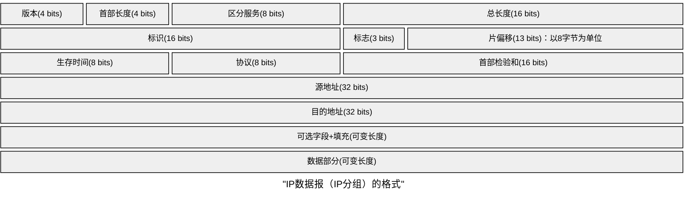

应用层FTP（控制21，数据20），HTTP（80），DNS(基于UDP),BGP(基于TCP)，RIP（基于UDP）
SMTP（基于TCP，25），POP3（基于TCP，110）
HTTP 请求行:首部行
请求航:方法，URL，版本(HTTP/1.0或HTTP/1.1)，CRLF

| 方法      | 意义              |
| ------- | --------------- |
| GET     | 请求读取由URL标识的信息   |
| HEAD    | 请求读取由URL标识的信息首部 |
| POST    | 给服务器添加信息        |
| CONNECT | 代理服务器           |
### 传输层
#### TCP
<table border="1" cellpadding="8" cellspacing="0" style="width:100%;text-align:center;font-family:Microsoft Yahei; font-size:14px; border-collapse:collapse;">
  <tr style="background:#f0f4f8;">
    <td style="width:50%; font-weight:bold;">源端口 (16 bit)</td>
    <td style="width:50%; font-weight:bold;">目的端口 (16 bit)</td>
  </tr>
  <tr>
    <td colspan="2" style="font-weight:bold;">序号 seq (32 bit)</td>
  </tr>
  <tr>
    <td colspan="2" style="font-weight:bold;">确认号 ack (32 bit)</td>
  </tr>
  <tr style="background:#f0f4f8;">
    <td style="font-weight:bold;">数据偏移(4b)｜保留(6b)｜URG ACK PSH RST SYN FIN(6bit) (合计16 b)</td>
    <td style="font-weight:bold;">窗口 rwnd (16 bit)</td>
  </tr>
  <tr>
    <td style="font-weight:bold;">检验和 (16 bit)</td>
    <td style="font-weight:bold;">紧急指针 (16 bit)</td>
  </tr>
  <tr style="background:#f0f4f8;">
    <td style="font-weight:bold;">选项 (可变)</td>
    <td style="font-weight:bold;">填充 (可变)</td>
  </tr>
</table>

注意⚠️
建立TCP链接时，握手1，2中协商MSS。
#### UDP

<table border="1" cellpadding="8" cellspacing="0" style="width:100%;text-align:center;font-family:Microsoft Yahei; font-size:14px; border-collapse:collapse;">
  <tr style="background:#f0f4f8;">
    <td style="width:50%; font-weight:bold;">源端口号 (16 bit)</td>
    <td style="width:50%; font-weight:bold;">目的端口号 (16 bit)</td>
  </tr>
  <tr>
    <td style="font-weight:bold;">UDP长度 (16 bit)</td>
    <td style="font-weight:bold;">UDP检验和 (16 bit)</td>
  </tr>
  <tr style="background:#f0f4f8;">
    <td colspan="2" style="font-weight:bold;">数据（如果有）(可变长度)</td>
  </tr>
</table>

注意⚠️
**UDP长度包含首部，以字节为单位**
首部固定8B,校验和由发送方传输层计算。

### 网络层
#### IP协议

==**418,首总偏**==,**首部4B为单位，总长度1B为单位，偏移量8B为单位。**

标识(16 bits)：由源主机生成，通常为自增序列
数据部分(可变长度)：受下一段链路的最短/最长帧长限制
标志(3 bits)：最高位不用管，**次低位DF，最低位MF**
**MF=1,后面还有分片；MF=0，最后一个分片。**
**DF=1，表示不允许被分片；DF=0，表示允许被分页**

#### V2标准以太网MAC帧

  
目的地址 6字节

  
源地址 6字节

  
类型 2字节

  
数据 （长度可变）

  
FCS 4字节

类型:指明网络层协议；数据段长度46B～1500B

#### 802.11标准以太网MAC帧

  
帧控制 2字节

  
持续期 2字节

  
地址1 6字节

  
地址2 6字节

  
地址3 6字节

  
序号控制 2字节

  
地址4 6字节

  
帧主体 0~2312字节

  
FCS 4字节

重点关注地址1，地址2，地址3；
记忆方法：30 N 4 首数验，首部3+1地址；90bit表去来，帧的中转靠AP
去往AP中起止，来自AP止中起。
其中帧控制包含协议版本，类型，去往ap，来自ap等。

路由选择协议RIP，BGP，OSFP