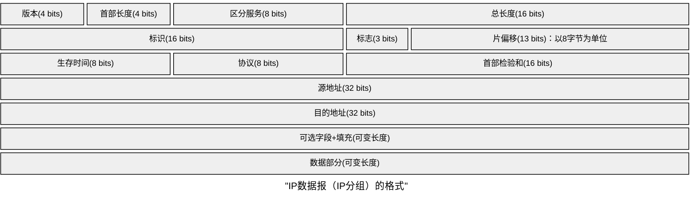

应用层FTP（控制21，数据20），HTTP（80），DNS(基于UDP),BGP(基于TCP)，RIP（基于UDP）
SMTP（基于TCP，25），POP3（基于TCP，110）
HTTP 请求行:首部行
请求航:方法，URL，版本(HTTP/1.0或HTTP/1.1)，CRLF

| 方法      | 意义              |
| ------- | --------------- |
| GET     | 请求读取由URL标识的信息   |
| HEAD    | 请求读取由URL标识的信息首部 |
| POST    | 给服务器添加信息        |
| CONNECT | 代理服务器           |
### 传输层
#### TCP
<table border="1" cellpadding="8" cellspacing="0" style="width:100%;text-align:center;font-family:Microsoft Yahei; font-size:14px; border-collapse:collapse;">
  <tr style="background:#f0f4f8;">
    <td style="width:50%; font-weight:bold;">源端口 (16 bit)</td>
    <td style="width:50%; font-weight:bold;">目的端口 (16 bit)</td>
  </tr>
  <tr>
    <td colspan="2" style="font-weight:bold;">序号 seq (32 bit)</td>
  </tr>
  <tr>
    <td colspan="2" style="font-weight:bold;">确认号 ack (32 bit)</td>
  </tr>
  <tr style="background:#f0f4f8;">
    <td style="font-weight:bold;">数据偏移(4b)｜保留(6b)｜URG ACK PSH RST SYN FIN(6bit) (合计16 b)</td>
    <td style="font-weight:bold;">窗口 rwnd (16 bit)</td>
  </tr>
  <tr>
    <td style="font-weight:bold;">检验和 (16 bit)</td>
    <td style="font-weight:bold;">紧急指针 (16 bit)</td>
  </tr>
  <tr style="background:#f0f4f8;">
    <td style="font-weight:bold;">选项 (可变)</td>
    <td style="font-weight:bold;">填充 (可变)</td>
  </tr>
</table>

注意⚠️
**TCP固定首部20B**
封装到tcp要注意TCP的MSS！
如果是3200B的应用层，会在TCP层根据MSS分片。
建立TCP链接时，握手1，2中协商MSS。
#### UDP

<table border="1" cellpadding="8" cellspacing="0" style="width:100%;text-align:center;font-family:Microsoft Yahei; font-size:14px; border-collapse:collapse;">
  <tr style="background:#f0f4f8;">
    <td style="width:50%; font-weight:bold;">源端口号 (16 bit)</td>
    <td style="width:50%; font-weight:bold;">目的端口号 (16 bit)</td>
  </tr>
  <tr>
    <td style="font-weight:bold;">UDP长度 (16 bit)</td>
    <td style="font-weight:bold;">UDP检验和 (16 bit)</td>
  </tr>
  <tr style="background:#f0f4f8;">
    <td colspan="2" style="font-weight:bold;">数据（如果有）(可变长度)</td>
  </tr>
</table>

注意⚠️UDP没有MSS。如果是3200B的应用层，不会在UDP层分片。
**UDP长度包含首部，以字节为单位**
首部固定8B,校验和由发送方传输层计算。

### 网络层
#### IP协议

**封装帧时，IP的固定首部为20B**
基本没有坑
==**418,首总偏**==,**首部4B为单位，总长度1B为单位，偏移量8B为单位。**

标识(16 bits)：由源主机生成，通常为自增序列
数据部分(可变长度)：受下一段链路的最短/最长帧长限制
标志(3 bits)：最高位不用管，**次低位DF，最低位MF**
**MF=1,后面还有分片；MF=0，最后一个分片。**
**DF=1，表示不允许被分片；DF=0，表示允许被分页**

IP交给数据链路分片时，每个片长度必须能被8整除。比如数据链路MTU=800B，IP层首部20B+780B是错的！只能20B+776B。
$偏移量=前面分片的数据内容/8B$ 最后一个片数据部分不需要8B整数倍。
如果下一段链路需要分片，但是DF=1不允许分片，则丢弃帧并返回ICMP差错报文。

#### V2标准以太网MAC帧

  
目的地址 6字节

  
源地址 6字节

  
类型 2字节

  
数据 （长度可变）

  
FCS 4字节

662n4，收发协数验
类型:指明网络层协议；数据段长度46B～1500B

#### 802.11标准以太网MAC帧

  
帧控制 2字节

  
持续期 2字节

  
地址1 6字节

  
地址2 6字节

  
地址3 6字节

  
序号控制 2字节

  
地址4 6字节

  
帧主体 0~2312字节

  
FCS 4字节

重点关注**地址1，地址2，地址**3；
记忆方法：30 N 4 首数验，首部3+1地址；90bit表去来，
**帧的中转靠AP，去往AP中起止，来自AP止中起。**
其中帧控制包含协议版本，类型，去往ap，来自ap等。
持续期：NAV，虚拟载波监听（此帧之后我还要占据信道多久，不包括本CTS，据此计算）

### 考前回顾协议
1.用TCP的应用层协议

| 协议                         | 端口  | 备注                                                                            |
| -------------------------- | --- | ----------------------------------------------------------------------------- |
| HTTP                       | 80  | 无状态 + Cookie                                                                  |
| FTP 控制连接                   | 21  | 全程保持，只传 FTP 命令 / 应答（带外控制）                                                     |
| FTP 数据连接                   | 20  | 主动模式下由服务器从 20 端口发起                                                            |
| SMTP                       | 25  | 只 "推"，只传 7 位 ASCII（靠 MIME 扩展）。发送方用户代理 SMTP (推) → 发送方邮件服务器 SMTP (推) → 接收方邮件服务器 |
| POP3                       | 110 | 收件方用户代理（邮箱客户端），用 POP3 从服务器把邮件 "拉" 下来                                          |
| BGP                        | 179 | 外部网关协议，用 TCP                                                                  |
| DNS（服务器之间批量同步 / 响应 > 512B） | 53  | DNS 是 TCP&UDP 两面派，可能设坑。考研默认 DNS 基于 UDP                                        |
2.UDP层的应用层协议

| 协议        | 端口           | 备注          |
| --------- | ------------ | ----------- |
| DNS(普通查询) | 53           | 短，快，报文<512B |
| DHCP      | 服务器67/客户端68， | 都应熟知        |
| RIP       | 520          | 内部网关协议，UDP  |
3.不经过传输层的协议

| 协议                       | 封装位置                                        | 标识                 |
| ------------------------ | ------------------------------------------- | ------------------ |
| ICMP                     | IP 数据报的数据部分                                 | 协议号 1              |
| IGMP（超纲）                 | IP 数据报的数据部分                                 | 协议号 2              |
| OSPF                     | IP 数据报的数据部分                                 | 协议号 89             |
| ARP                      | 直接封装在以太网帧中                                  | 帧的类型（协）字段 = 0x0806 |
| PPP                      | 它自己就是链路层协议，不 "基于" 任何高层协议 —— 它直接跑在物理层的点对点链路上 | —                  |
| PPPoE（PPP over Ethernet） | PPP 帧被塞进以太网帧里，属于 "链路层套链路层" 的特例              | —                  |
664N2收发协数验

## 路由选择协议RIP，BGP，OSFP
1.分析初始直连由判断RIP完全收敛的时间
2.区分RIP表和路由转发表
3.好消息传得快
4.坏消息传得慢

RIP和OSPF:都是最佳路径。
### BGP
BGP用于AS之间交换信息，属外部网关协议。
1)BGP力求找到AS间**比较好的路由**，而不是"**最佳路由**"。
2)AS间路由选择考虑政治安全等因素。
3)BGP采用路径向量路由算法--路由器之间通告BGP路由信息核实，不仅告知目的地，还告知到达目的地的完整路径。
4）BGP是应用层协议，基于TCP。179.
BGP路由器：（普通路由器：物理层，链路层，网络层）+传输层，应用层

BGP邻居：BGP协议通信双方是BGP对等方，或叫做BGP邻居。
BGP邻居县建立TCP连接，然后在该连接上交换BGP报文，实现BGP会话。

两类BGP会话：AS之间的直连路由器：长期eBGP会话。
AS内部所有路由器之间：长期双向iBGP会话（全连通，完全图）

#### BGP路由信息
BGP路由信息：CIDR前缀+BGP属性。
BGP属性：AS-PATH + NEXT_HOP
##### BGP路由选择
1.本地偏好值最高2.AS跳数最少3.热土豆算法4.BGP标识符最小

##### BGP四种报文
1.OPEN打开用于相邻BGP邻居建立BGP会话
2.update更新3.Keepalive保活：周期性通知BGP对等方我活着
4.Notification通知
