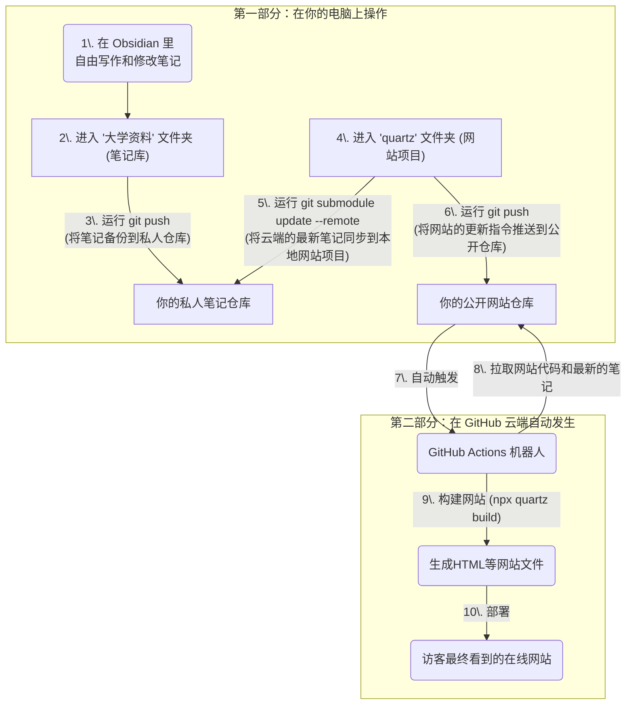

 🌿 我的数字花园 · Obsidian × Quartz 

这是我的首页！

本项目的构建流程

```mermaid
graph TD
    subgraph a[第一部分：在你的电脑上操作]
        obsidian(1\. 在 Obsidian 里<br>自由写作和修改笔记)
        notes_folder["2\. 进入 '大学资料' 文件夹 (笔记库)"]
        quartz_folder["4\. 进入 'quartz' 文件夹 (网站项目)"]

        obsidian --> notes_folder
        notes_folder -- "3\. 运行 git push<br>(将笔记备份到私人仓库)" --> github_private
        
        quartz_folder -- "5\. 运行 git submodule update --remote<br>(将云端的最新笔记同步到本地网站项目)" --> github_private
        quartz_folder -- "6\. 运行 git push<br>(将网站的更新指令推送到公开仓库)" --> github_public
    end
    
    subgraph b[第二部分：在 GitHub 云端自动发生]
        github_private[你的私人笔记仓库]
        github_public[你的公开网站仓库]
        
        github_public -- "7\. 自动触发" --> actions(GitHub Actions 机器人)
        
        actions -- "8\. 拉取网站代码和最新的笔记" --> github_public
        actions -- "9\. 构建网站 (npx quartz build)" --> build(生成HTML等网站文件)
        build -- "10\. 部署" --> pages(访客最终看到的在线网站)
    end
```

 
 ✨ 本站由Obsidian双链笔记驱动，Quartz静态部署，内容持续更新生长 
 

